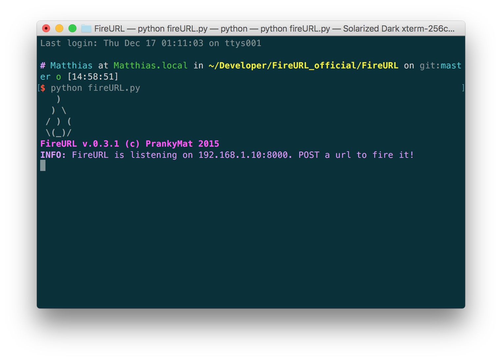
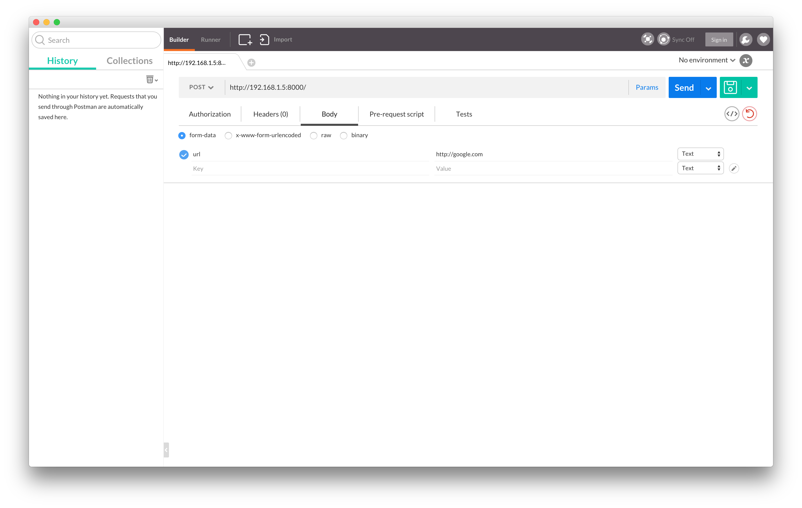

# Getting started with FireURL :fire::fire:

## What is FireURL
FireURL is a handy application that helps you share links easily between two devices. Recall that awkward moment when you want to open a web page that you're browsing on your phone to your computer in front of you; with FireURL you can now easily __Fire__ the link to your computer from your phone. 

## Cool, how do I get started?
__Prerequisites__

First you'll need to have a computer (Currently, [FireURL Server] supports Windows, Mac, and Linux) that has [Python 2](https://www.python.org/) installed. If you are running OSX, ```Python 2``` should have it pre-installed.

(:warning: Avoid installing ```Python 3```, __FireURL__ only runs on ```Python 2```)

__Download the files needed__

Next you'll need to download the [FireURL Server] python script onto your computer. [TBD: Link to tutorial]

__Time to run the [FireURL Server]__

After you've downloaded the script, run the script using the command:
```sh
python fireURL.py
```
This will start a [FireURL Server] on port ```8000```.



__Note:__ If you wish to specify the port that FireURL should listen on, you can use the command ```python fireURL.py 4444``` Where ```4444``` is the port number that you specify.


## I've got a server running! What's next?

__Fire an URL to the computer! Using a ```GET``` request__

The mechanism of FireURL is rather simple. The server (which sits inside your computer) will listen for a HTTP request that contains some formatted URL (web link). Once it has received the request, it will open up the link in the default browser (Chrome or Firefox, etc.)

There are many types of HTTP requests. ```GET```, ```POST```, ```PUT```, ```DELETE``` are some of the common examples of HTTP requests. These requests, sent by a ```client``` will then be received and interpreted by the ```server``` in this case, open the URL sent by the ```client``` on the ```server``` computer's default browser.

[FireURL Server] listens only specifcally crafted ```GET``` and ```POST``` requests. It will not process other kinds of HTTP requests such as ```PUT``` and ```DELETE```.

Making a ```GET``` request is suprisingly easy. We use it everyday when we browse the internet. Simply open a new browser window, type in an URL (Web link), ```http://google.com/``` and hit enter, and congratulations! You've just made a ```GET``` request to the server ```google.com```.

It works the same for [FireURL Server], you'd type in the address of the [FireURL Server], specify what URL you want it to open, and hopefully the server will understand and open the web page on your target computer. For example, if your [FireURL Server]'s IP address is at ```192.168.1.5```, and you'd want the server to open up ```http://youtube.com/``` for you. You'd then use this URL (Web link) in your browser: ```http://192.168.1.5/?url=youtube.com/```

Neat! ```http://youtube.com/``` will now be showing up on your server's browser. How awesome is that!

__```POST``` to the computer instead!__

Using ```GET``` request is simple and easy to understand, however it is not as reliable as using ```POST``` request. The reason is because some speical characters in an URL may show up differently in a ```GET``` request per browser. For this reason, it's better to use ```POST``` request to avoid unexpected encoding of an URL.

In order to create a ```POST``` request to our [FireURL Server], we cannot create it simply by browsing a URL like we did in ```GET``` request. Instead, we need to use an application that creates HTTP requests to our server. I'd recommend [Postman] for its simplicity and ease of usage. However you're welcome to use any [other REST Clients](https://www.google.com/search?q=rest+clients) available to you. (```curl``` if you are comfortable with command line interface)

```POST``` requests are similar to ```GET``` requests. They both need a server address, and the URL that you wish to open on the server. However instad of appending the URL at the end of the server's address like we did in our ```GET``` request, we need to pass some ```form-data``` in our ```POST``` request for [FireURL Server] to understand what we're trying to do. ([Detailed on the difference between HTTP ```GET``` and ```POST```](http://www.w3schools.com/tags/ref_httpmethods.asp))

In our ```POST``` request, we'd need to specify where we want the request to be sent, and what content (```form-data```) we'd like to send. Our ```POST``` request should look something like this:



If we send this request out, we'll see the web page opening on our server's computer! Neat!

## These all seemed complicated! Are there any simplier ways to use __FireURL__?
Yes. Well sort of. Official client apps for __FireURL__ are currently being developed. Here is the list of their repos:

- iOS: https://github.com/FireURL/FireURL-Client-iOS
- Android: TBD

These apps aim to open web links from your mobile device to computer quickly and easily. Please refer to instructions in those repos to find installation guides and usages.

[Postman]: https://www.getpostman.com/
[FireURL Server]: https://github.com/FireURL/FireURL-Server
